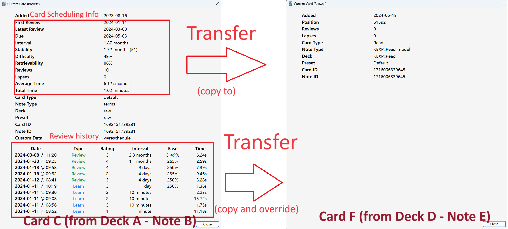
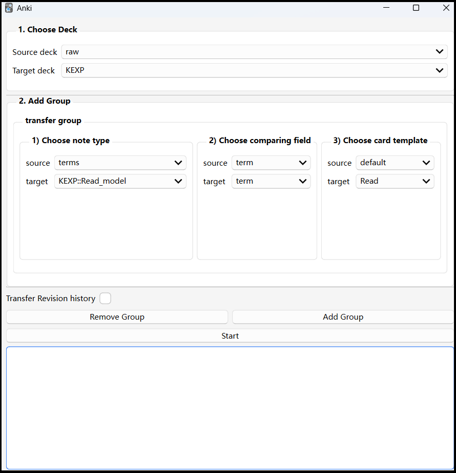

# Transfer Scheduling Advanced
an anki add-on to transfer scheduling info from cards to cards in batch.

# Demo

# Download
> Supported Anki Versions  
> 2.1.54 - 24.04.1+

To download this add-on, please copy and paste the following code into Anki:
#### `1249258442`

If you were linked to this page from the internet, please open Anki on your computer, go to the Tools->Add-ons menu item, then click on Get Add-ons and paste in the code.

# Usage
### 1. Open this tool from Anki dropdown menu. `Tools - Transfer Scheduling Data`
### UI

### 2. Choose Deck
1) choose the source deck containing the source cards.
2) choose the target deck containing the target cards.

### 3. Add more detail
in the first transfer group,
1) choose the note type of source card and target card. 
> _if you don't know what note type it is_  
> a) click the `Browser` button located at the top of Anki.  
> b) switch to card view by clicking a blue/green switch, make sure it shows "Cards".   
> c) find the source card you want to transfer from.  
> d) right-click the card, click `Info...`.  
> e) in the pop-up window, Check the `Note Type` field.  
2) choose a field from source card and target card for comparing. Transfer only occurs in two cards that has matched field.
3) choose the card template of source card and target card.

### 4. (optional) Click Add Group button if you have more transfer type 

### 5. (optional) Check "Transfer Revision History" if you also want the revision history of source card be transferred.
Warning. the revision history of target card will be overridden.

### 6. Click Start button

# Note
1. If a source card is new(hasn't been studied before), it will be skipped.  
